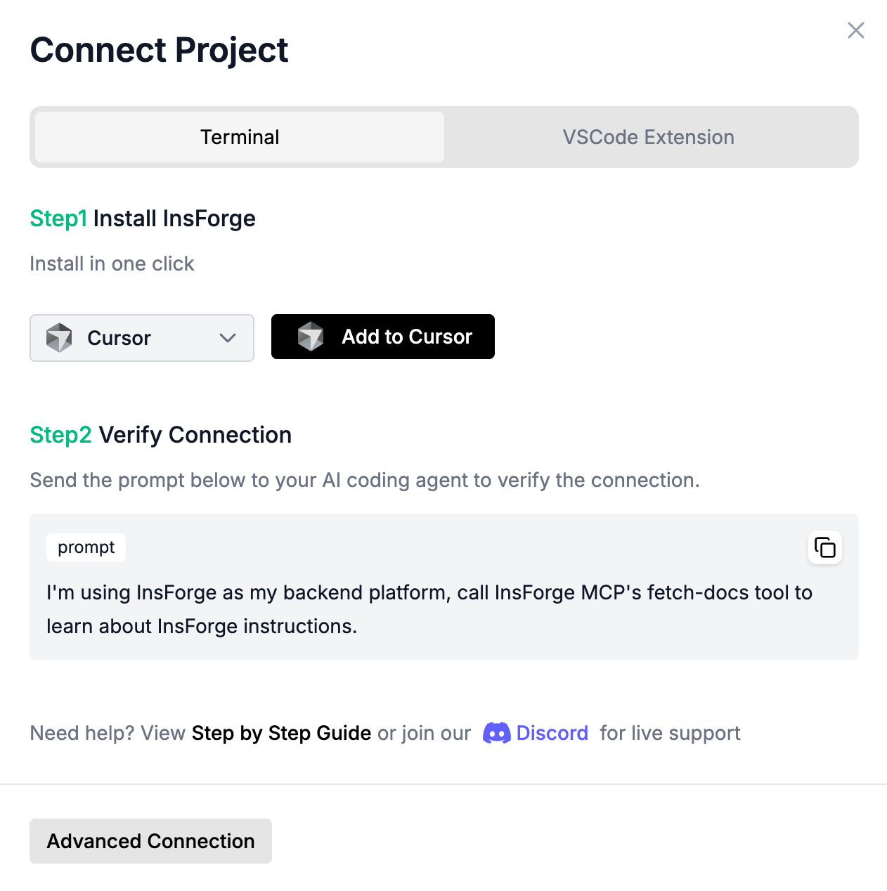

# Deploy InsForge with Docker

## Prerequisites

- Docker and Docker Compose installed on your machine

## Setup InsForge

### Step 1: Download the Docker Compose file

```bash
wget https://raw.githubusercontent.com/insforge/insforge/main/deploy/docker-compose/docker-compose.yml
wget https://raw.githubusercontent.com/insforge/insforge/main/deploy/docker-compose/.env.example
mv .env.example .env
```

### Step 2: Start InsForge

```bash
docker compose up -d
```

### Step 3: Access InsForge

Open your browser and navigate to `http://localhost:7130`, you can see the InsForge dashboard as below:

<div align="center">
  
</div>

## Start using InsForge

### 1. Connect InsForge MCP

Open [InsForge Dashboard](http://localhost:7130), Follow the steps to connect InsForge MCP Server:

<div align="center">
  
</div>

### 2. Verify installation

To verify the connection, send the following prompt to your agent:
```
I'm using InsForge as my backend platform, call InsForge MCP's fetch-docs tool to learn about InsForge instructions.
```

### 3. Start building your project

Build your next todo app, Instagram clone, or online platform in seconds!

Sample Project Prompt:

```
Build an app similar to Reddit with community-based discussion threads using InsForge as the backend platform that has these features:

- Has a "Communities" list where users can browse or create communities
- Each community has its own posts feed
- Users can create posts with a title and body (text or image upload to InsForge storage)
- Users can comment on posts and reply to other comments
- Allows upvoting and downvoting for both posts and comments
- Shows vote counts and comment counts for each post
```
