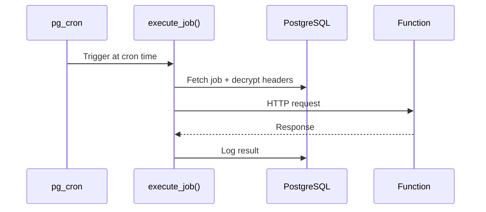

## Overview

InsForge Schedules lets you run serverless functions on a recurring cron schedule. Jobs are managed entirely in PostgreSQL using the `pg_cron` extension, which executes HTTP requests to your function endpoints at the specified intervals.

## Technology Stack

```mermaid
graph TB
    Admin[Admin Dashboard] --> API[Schedules API]
    API --> Service[Schedule Service]
    Service --> DB[(PostgreSQL)]

    DB --> PGCron[pg_cron]
    PGCron --> Execute[execute_job]
    Execute --> HTTP[HTTP Extension]
    HTTP --> Function[Function Endpoint]
    Execute --> Logs[schedules.job_logs]

    style Admin fill:#1e293b,stroke:#475569,color:#e2e8f0
    style API fill:#166534,stroke:#22c55e,color:#dcfce7
    style Service fill:#166534,stroke:#22c55e,color:#dcfce7
    style DB fill:#0e7490,stroke:#06b6d4,color:#cffafe
    style PGCron fill:#c2410c,stroke:#fb923c,color:#fed7aa
    style Logs fill:#0e7490,stroke:#22d3ee,color:#cffafe
    style Execute fill:#4c1d95,stroke:#8b5cf6,color:#ede9fe
    style HTTP fill:#c2410c,stroke:#fb923c,color:#fed7aa
    style Function fill:#1e40af,stroke:#3b82f6,color:#dbeafe
```

## Core Components

| Component | Technology | Purpose |
|-----------|------------|---------|
| **Scheduler** | pg_cron | PostgreSQL-native cron job scheduling |
| **HTTP Client** | pg http extension | Execute HTTP requests from within PostgreSQL |
| **Encryption** | pgcrypto (AES) | Encrypt sensitive headers at rest |
| **Job Store** | PostgreSQL | Job definitions and execution logs |
| **Service Layer** | Node.js | Cron validation, secret resolution, CRUD |

## How It Works

When a schedule is created:

1. The cron expression is validated (5-field format, no seconds)
2. Secret placeholders (`${{secrets.KEY}}`) in headers are resolved and encrypted
3. A pg_cron job is registered that calls `execute_job()` on the cron schedule

When pg_cron fires:

1. `execute_job()` fetches the job definition and decrypts headers
2. An HTTP request is made to the function endpoint
3. The result (status code, duration, success/failure) is logged to `schedules.job_logs`

### Execution Flow

## Cron Expressions

Standard 5-field format — seconds are not supported.

| Expression | Schedule |
|------------|----------|
| `*/5 * * * *` | Every 5 minutes |
| `0 * * * *` | Every hour |
| `0 0 * * *` | Daily at midnight |
| `0 9 * * 1` | Every Monday at 9am |
| `0 0 1 * *` | First of every month |

## Secret Management

Headers support `${{secrets.KEY_NAME}}` template syntax. Secrets are resolved at creation time, encrypted with `pgcrypto`, and decrypted only at execution time. Template headers (without secret values) are stored separately for safe display in the dashboard.

<Warning>
If a referenced secret is deleted, scheduled jobs using it will fail. Update or disable affected schedules after removing secrets.
</Warning>

## Best Practices

1. **Test First**: Invoke your function manually before scheduling it
2. **Use Secrets**: Pass API keys via header secrets instead of hardcoding
3. **Stay Fast**: Functions should complete within the 30-second timeout
4. **Monitor Logs**: Check execution logs for failures and unexpected status codes
5. **Disable, Don't Delete**: Pause schedules temporarily instead of recreating them

## Limitations

- **Minimum Interval**: 1 minute (pg_cron limitation)
- **No Seconds**: 5-field cron expressions only
- **Admin Only**: Schedules are managed by project admins
- **No Retry**: Failed executions are logged but not automatically retried
